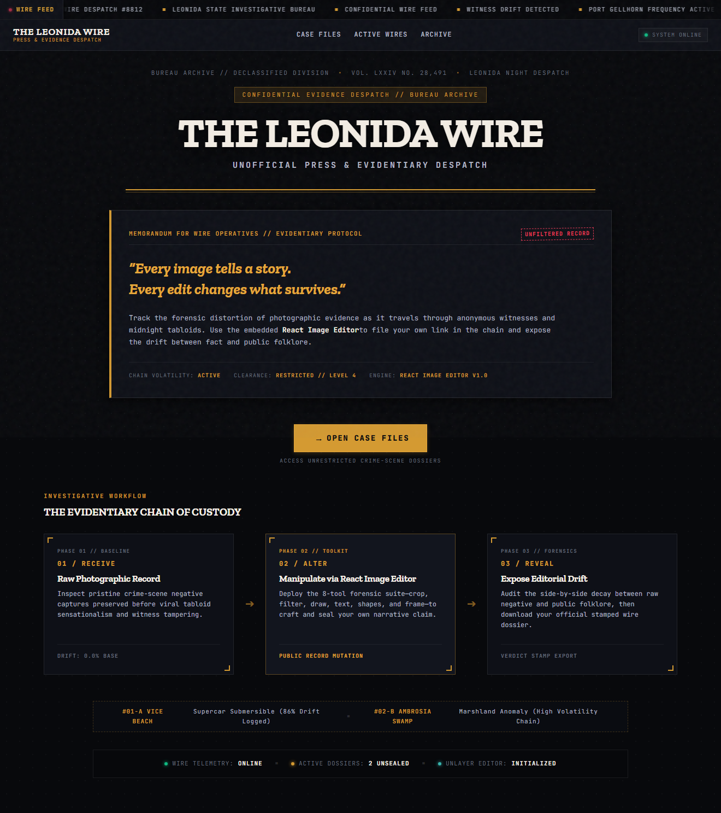
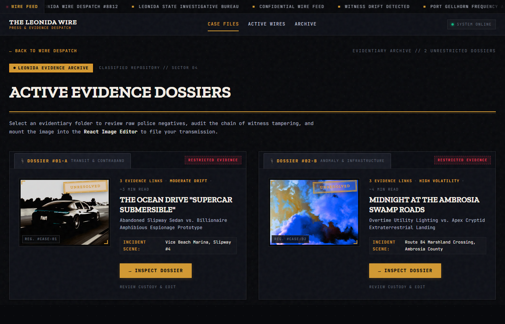
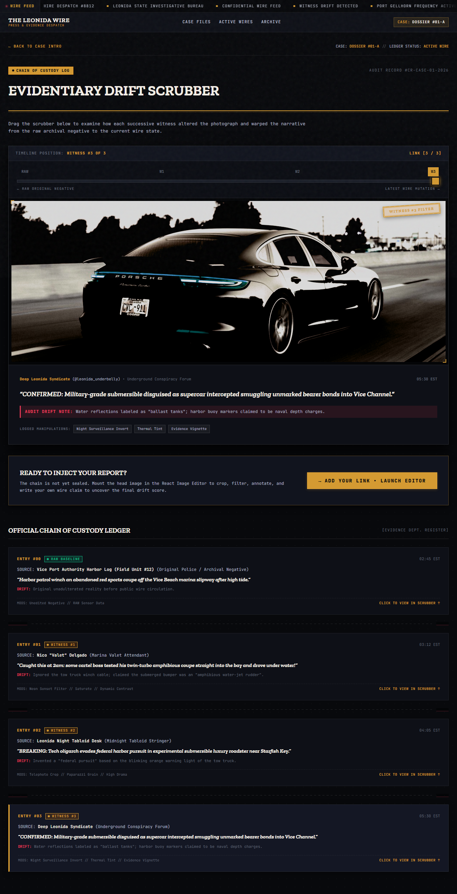
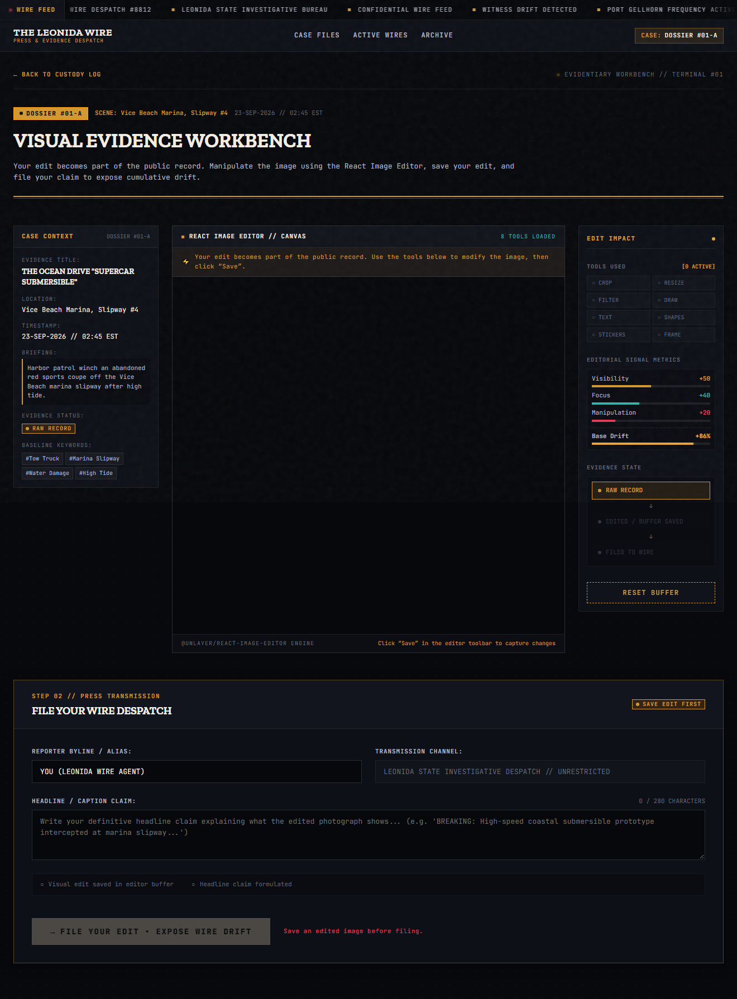
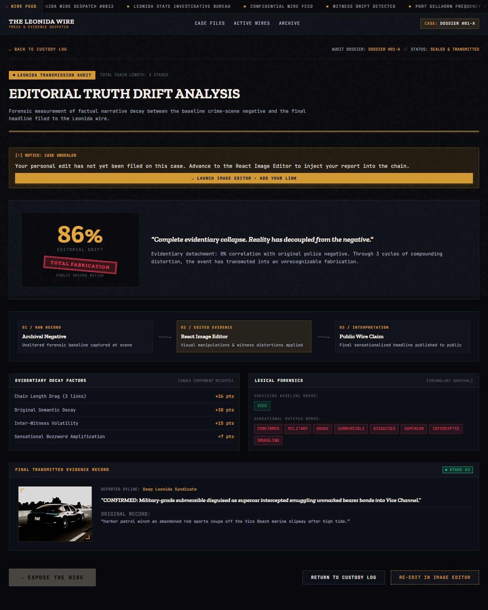
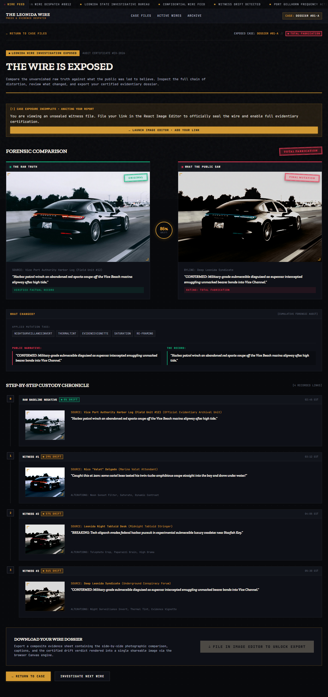

# THE LEONIDA WIRE

> Every image tells a story. Every edit changes what survives.

**The Leonida Wire** is an interactive, browser-based investigative press and evidentiary experience built for the **Build with React Image Editor Challenge**. Set in a fictional coastal metropolitan wire room, the application explores how photographic evidence mutates, degrades, and sensationalizes as it travels across consecutive witnesses and midnight tabloids.

Starting from an authentic, unaltered baseline negative captured by local authorities, players step into the role of an investigative press contributor. Rather than passively reading through an article, the player must actively inspect the unbroken custody log, take physical custody of the photographic record using the embedded **React Image Editor**, make visual alterations, formulation a headline claim, and file their link into the wire registry.

The application calculates the resulting cumulative factual divergence using a deterministic narrative drift engine, scoring the story between 0% and 100% and stamping it with an official public record verdict (*Verified*, *Disputed*, *Urban Legend*, or *Total Fabrication*). The player can then unroll the full custody chronicle side-by-side and export a composite, high-resolution evidence dossier rendered on an HTML5 canvas.

**Live Demo:** https://leonida-pi.vercel.app/  
**GitHub:** https://github.com/itssagarK/leonida

---

## Live Demo

Experience the complete investigative workflow live on Vercel:

👉 **[Open The Leonida Wire](https://leonida-pi.vercel.app/)**

---

## Interface & Workflow Showcase

| Stage | Visual Preview | Description |
| :--- | :--- | :--- |
| **01 — Masthead & Pipeline** |  | Newspaper front-page masthead, memorandum, and connected pipeline. |
| **02 — Case Dossiers** |  | Tactile Manila evidence folders, paperclips, and archival photo mounts. |
| **03 — Custody Scrubber** |  | Interactive timeline scrubber and teletype chain-of-custody ledger. |
| **04 — React Image Editor** |  | 3-Zone workbench with live VU-meter signals and Unlayer editor suite. |
| **05 — Drift Analysis** |  | Narrative decay calculations, breakdown weights, and lexical forensics. |
| **06 — Wire Reveal & Export** |  | Split-screen raw record vs. public claim with client-side canvas dossier export. |

---

## Overview

### What The Leonida Wire Is
The Leonida Wire is a single-page web application simulating a late-night classified newsroom terminal. Each case presents a real-world scenario (such as an abandoned slipway car or high-powered roadwork floodlights) that has been progressively twisted by anonymous tipsters and sensationalist tabloids into wild conspiracy theories.

### What the User Does
1. **Inspects the Record:** Selects a case file and reviews the original scene photograph, location, and archival logging data.
2. **Scrubs the Custody Chain:** Drags an interactive custody slider to inspect how previous witnesses distorted the image and narrative.
3. **Edits the Photograph:** Mounts the current evidence into the embedded React Image Editor to apply visual modifications (crops, filters, annotations, frames, text).
4. **Locks the Buffer & Files:** Saves the altered image buffer, drafts a headline claim, and formally files the edit.
5. **Audits Truth Drift:** Reviews the computed narrative drift index and public record rating.
6. **Exposes the Wire:** Compares *The Raw Truth* against *What the Public Saw* and downloads an evidentiary PNG dossier.

### Why Image Manipulation Is Part of the Investigation
In modern media and viral online discourse, photographic evidence is rarely published in its raw, objective state. Crops omit exculpatory surroundings; high-contrast filters create artificial drama; blur or saturation shifts turn mundane utility equipment into extraterrestrial phenomena. By requiring the user to physically edit the photograph with React Image Editor, the user actively experiences the exact mechanism by which truth is distorted.

### How Editing Changes the Progression
The user cannot skip the editor or jump straight to the conclusion. The application enforces strict progression gating: the filing CTA remains locked until the editor's native `onSave` hook captures an altered image into state. Once saved, the player's edit becomes the terminal link of the custody chain, directly influencing the drift calculations, the side-by-side comparison, and the final exported dossier.

---

## The Core Experience

### 01 — Receive the Record
Players begin by opening the **Evidentiary Archive** (`/cases`) and choosing an active case file:
* **Dossier #01-A:** *THE OCEAN DRIVE "SUPERCAR SUBMERSIBLE"* (Harbor slipway sedan tow vs. billionaire amphibious spy roadster).
* **Dossier #02-B:** *MIDNIGHT AT THE AMBROSIA SWAMP ROADS* (Nighttime utility road repair spotlights vs. apex cryptid extraterrestrial landing).

Opening a case loads the initial briefing, scene coordinates, archival timestamp, and the unaltered municipal negative.

### 02 — Investigate the Custody Log
In the **Custody Log** (`/case/:id/custody`), players examine the chronological history of the photograph. An interactive range slider scrubs between the baseline raw negative and every witness link. The viewport dynamically reflects each witness's applied visual style and caption in real time, accompanied by a police/press register detailing witness handles, timestamps, and audit drift notes.

### 03 — Manipulate the Evidence
Navigating to the **Visual Evidence Workbench** (`/case/:id/edit`) presents a specialized three-zone interface:
* **Left (Case Context):** Displays dossier number, scene location, date logged, briefing summary, baseline keywords, and current buffer status.
* **Center (Image Canvas):** Hosts the embedded `@unlayer/react-image-editor` loaded with the distorted witness negative. Players have access to all 8 core creative tools: **Crop, Resize, Filter, Draw, Text, Shapes, Stickers, and Frame**.
* **Right (Edit Impact):** A live diagnostics panel tracking tool engagement (`✓ CROP` vs. `○ DRAW`), real-time editorial signals (Visibility, Focus, Manipulation, Base Drift), single-active evidence state indicator, and a buffer reset action.

### 04 — Save the Evidence
Inside the React Image Editor toolbar, the player clicks the native **"Save"** button. This fires the editor's `onSave` callback, capturing the high-resolution modified image as a base64 `dataUrl` into React state. The interface confirms capture with an instant verification notice: `✓ EDIT SAVED: Evidence buffer captured successfully.`

### 05 — File the Evidence
With the evidence buffer locked, the player proceeds to the **Press Transmission Filing** section below the canvas. The player enters their reporter alias and formulates a headline claim. Pre-flight checklist indicators verify that both a saved image buffer and a valid headline exist before enabling the primary CTA: `[ FILE YOUR EDIT • EXPOSE WIRE DRIFT ]`.

### 06 — Measure Editorial Drift
Filing the report routes to **Truth Drift Analysis** (`/case/:id/status`). The system computes narrative decay across the custody chain, presenting:
* A central large drift score hero (`XX% EDITORIAL DRIFT`).
* An official stamped public record rating:
  * **VERIFIED (0% – 24%):** Factual corroboration with baseline negative.
  * **DISPUTED (25% – 49%):** Substantial divergence; key facts contested.
  * **URBAN LEGEND (50% – 74%):** Viral folklore and sensationalism dominate.
  * **TOTAL FABRICATION (75% – 100%):** Complete evidentiary detachment from reality.
* Horizontal progression: `01 / RAW RECORD → 02 / EDITED EVIDENCE → 03 / INTERPRETATION`.
* Detailed factor breakdown (chain drag, semantic decay, volatility, buzzword amplification) and lexical forensics (retained vs. mutated vocabulary).

### 07 — Expose the Wire
Clicking `[ EXPOSE THE WIRE ]` opens the **Wire Reveal** (`/case/:id/reveal`), the visual climax of the investigation:
* A large split-screen comparison: **THE RAW TRUTH** vs **WHAT THE PUBLIC SAW** centered on a circular drift meter.
* Compact uppercase mutation tags (`CROP`, `FILTER`, `TEXT`, `DRAW`, `FRAME`, `SATURATION`, `RE-FRAMING`).
* Direct side-by-side quote blocks comparing the **PUBLIC NARRATIVE** against **THE RECORD**.
* A step-by-step custody chronicle detailing every link from baseline to final edit.

### 08 — Download the Dossier
Clicking `[ DOWNLOAD YOUR WIRE DOSSIER ]` triggers a client-side HTML5 Canvas compositor. The browser renders a high-resolution 1200×800 evidence sheet containing both photographs, case metadata, headlines, bylines, and the stamped verdict, triggering an instant `.png` download directly in the browser with zero external image APIs.

---

## React Image Editor Integration

> React Image Editor is the core interaction of The Leonida Wire. The player must manipulate and save the photographic evidence before the evidence can be filed and processed through the editorial-drift workflow.

1. **Package Used:**
   `@unlayer/react-image-editor` (`v1.0.2`), imported as a controlled React component.
2. **Mount Location:**
   Mounted directly in the center zone of [`src/screens/EditorScreen.jsx`](./src/screens/EditorScreen.jsx).
3. **Available Capabilities:**
   All 8 core tools are unlocked with a dark theme integration matching the terminal aesthetic:
   * **Crop:** Re-framing the image to exclude exculpatory surrounding context.
   * **Resize:** Modifying image dimensions and canvas resolution.
   * **Filter:** Applying chromatic shifts, contrast spikes, sepia tones, and surveillance tints.
   * **Draw:** Adding freehand brush annotations and highlight lines.
   * **Text:** Adding breaking-news watermarks and claim headlines.
   * **Shapes:** Inserting forensic callout boxes, circles, and directional arrows.
   * **Stickers:** Stamping badges, icons, and contextual markers.
   * **Frame:** Applying photographic borders and editorial margins.
4. **Interaction Tracking:**
   An interaction listener on the editor host container (`editorHostRef`) detects user clicks across tool categories (`Crop`, `Resize`, `Filter`, `Draw`, `Text`, `Shapes`, `Stickers`, `Frame`). Active tools are flagged with `✓ TOOL` while unused tools remain in a muted `○ TOOL` state in the `TOOLS USED` panel.
5. **How Edits Are Saved:**
   When the user clicks "Save" inside the editor, the `onSave` prop callback fires with `{ dataUrl }`. The returned base64 string is stored in React component state (`savedDataUrl`), setting `hasSavedImage = true`.
6. **How Saved Images Affect Progression:**
   * Before saving: The filing button remains disabled, displaying `Save an edited image before filing.` Players cannot skip directly to the drift or reveal screens.
   * After saving: The filing form unlocks, allowing headline formulation.
   * Reset Buffer (`[ RESET BUFFER ]`): Clears the saved image, resets tool tracking, wipes draft text, reloads the baseline negative, and returns the state indicator strictly to `RAW RECORD`.
7. **How the Edit Feeds into Drift and Reveal:**
   Upon filing, `playerLink` is stored in `localStorage` under `leonida_wire_progress_${caseId}`. The helper `getEffectiveChain()` dynamically injects the player's edit as the terminal link in the custody chain. The drift engine processes the player's caption against the original negative keywords, calculating semantic decay and assigning the final verdict band.
8. **How the Edited Evidence Appears in the Dossier:**
   In [`src/screens/RevealScreen.jsx`](./src/screens/RevealScreen.jsx), the canvas compositor loads both the original municipal negative and the player's saved `imageDataUrl`, drawing them side-by-side with border rules, captions, and drift stamps onto a 1200×800 canvas for PNG export.

---

## Why Image Editing Is the Mechanic

In most web applications, an image editor serves an auxiliary, decorative role—cropping a profile picture or applying a cosmetic social media filter.

In **The Leonida Wire**, image manipulation is designed as the core investigation mechanic:

```text
EDIT → SAVE → FILE → MEASURE DRIFT → REVEAL
```

1. **Direct Narrative Agency:** The player does not simply read about narrative drift; they are the agent causing it. The visual edits made by the player directly reflect how media distortion occurs in real-world news ecosystems.
2. **Mechanical Gating:** The editor cannot be bypassed. The application's state machine requires an image buffer before a case can be closed.
3. **Forensic Feedback Loop:** Every edit made in the canvas feeds into downstream screens—updating the custody scrubber, calculating vocabulary overlap, and populating the final exportable dossier.

---

## Features

* **Original Evidentiary Cases:** Authored cases with baseline municipal negatives, forensic metadata, and multi-link witness chains (*The Ocean Drive "Supercar Submersible"* and *Midnight at the Ambrosia Swamp Roads*).
* **Classified Case Selection:** Evidence folder layout with folder tabs, case numbers, unsealed status stamps, photo thumbnails, difficulty ratings, and estimated completion times.
* **Interactive Custody Timeline & Scrubber:** Multi-step range slider scrubbing through all chain states with real-time synchronized viewport rendering.
* **Forensic Evidence Ledger:** Monospace witness register detailing entry timestamps, sources, quotes, and audit drift notes.
* **Embedded React Image Editor:** Full integration of `@unlayer/react-image-editor` featuring a dark theme, 8 creative tools, and responsive scaling.
* **Live Tool Usage Tracking:** Real-time checklist identifying which editor tools have been actively engaged (`✓ CROP` vs. `○ DRAW`).
* **Deterministic Editorial Signals:** Live metrics (Visibility, Focus, Manipulation, Base Drift) updating deterministically based on tool use and save state.
* **Save/Edit Buffer Management:** Immediate buffer capture, clear visual save feedback, and clean buffer reset capability.
* **Strict Evidence Gating:** Prevents progression or submission until photographic evidence has been edited and saved.
* **Press Filing Workflow:** Teletype byline and story headline entry with live character counter and pre-flight validation.
* **Deterministic Editorial Drift Engine:** Mathematical heuristic computing factual decay (0–100%) and 4 public-record status bands based on chain length friction, semantic decay, inter-witness volatility, and sensational buzzwords.
* **Large Split-Screen Comparison:** Side-by-side photographic comparison of *The Raw Truth* vs. *What the Public Saw* with a center circular drift meter.
* **Compact Mutation Tags:** Highlights specific visual alterations (`CROP`, `FILTER`, `TEXT`, `DRAW`, `FRAME`, `SATURATION`, `RE-FRAMING`).
* **Public Narrative vs. The Record:** Direct side-by-side comparison of the player's headline claim against the baseline municipal caption.
* **HTML5 Canvas Dossier PNG Exporter:** Native in-browser canvas compositor producing high-resolution, shareable 1200×800 evidence posters with zero external image-processing dependencies.
* **Client-Side Persistence:** LocalStorage persistence for player submissions and case progress, with clean per-case reset controls.
* **Persistent Navigation:** Global newsroom navbar featuring brand wordmark, section navigation, live status indicator (`● SYSTEM ONLINE`), and active case indicator.
* **Deep-Link Routing & Fault Tolerance:** Full React Router v6 route coverage with alias resolution (`case-01`, `1`, `case-1`) and graceful fallback handling.
* **Responsive Architecture:** Tailored layouts across mobile (375px), tablet (768px), and desktop (1024px+ / 1320px container).

---

## User Flow

```text
CASE FILE
    ↓
RAW EVIDENCE
    ↓
CUSTODY LOG
    ↓
REACT IMAGE EDITOR
    ↓
SAVE EDIT
    ↓
FILE EVIDENCE
    ↓
EDITORIAL DRIFT
    ↓
WIRE REVEAL
    ↓
DOSSIER
```

---

## Technical Architecture & Local Setup

### Tech Stack
* **Frontend Library:** React 18 (`react` v18.3.1, `react-dom` v18.3.1)
* **Build System:** Vite 6 (`vite` v6.4.3, `@vitejs/plugin-react` v4.3.4)
* **Image Editor Engine:** `@unlayer/react-image-editor` (`v1.0.2`)
* **Routing:** React Router v6 (`react-router-dom` v6.28.0)
* **Styling:** Vanilla CSS3 with an 8px spacing scale, CSS Custom Properties (`tokens.css`), and responsive grid/flexbox layouts
* **Export Engine:** Native HTML5 Canvas 2D API with dynamic text wrapping
* **Persistence:** Browser `localStorage` API

### Installation & Local Run
```bash
# 1. Clone the repository
git clone https://github.com/itssagarK/leonida.git
cd leonida

# 2. Install dependencies
npm install

# 3. Start local development server with Vite
npm run dev
# -> Local server opens at http://localhost:5173
```

### Production Build & Preview
```bash
# Compile and bundle for production
npm run build

# Preview production build locally
npm run preview
```

---

## Legal & Fictional Universe Disclaimer

*The Leonida Wire* is an original fictional creative work inspired by the atmospheric, satirical, and tropical character of coastal reporting and late-night tabloid journalism.

It is **not affiliated with, endorsed by, sponsored by, or in any way associated with Rockstar Games, Take-Two Interactive, or any of their subsidiaries or affiliates.** All characters, locations, incidents, headlines, and dossiers are purely fictional original creations. All baseline images used are royalty-free photographic assets.
